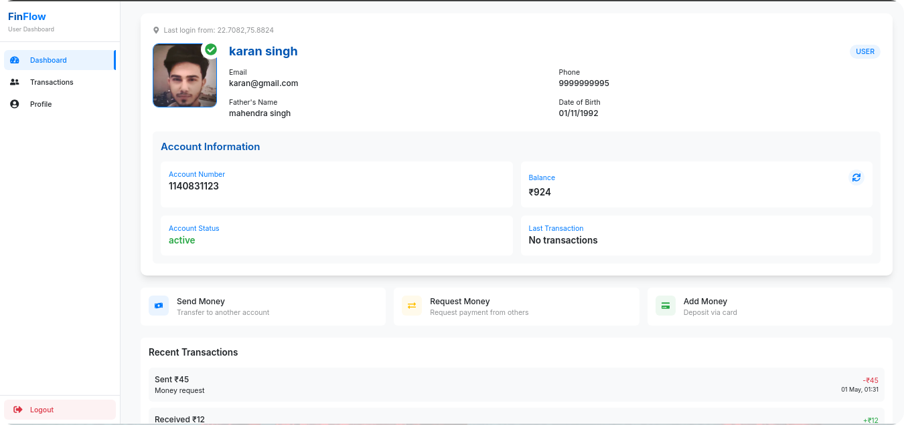
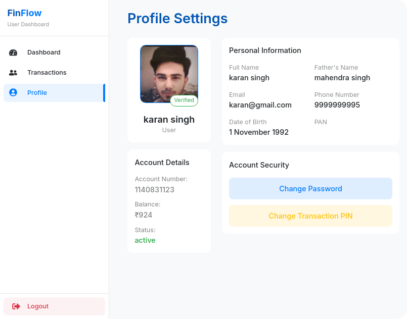
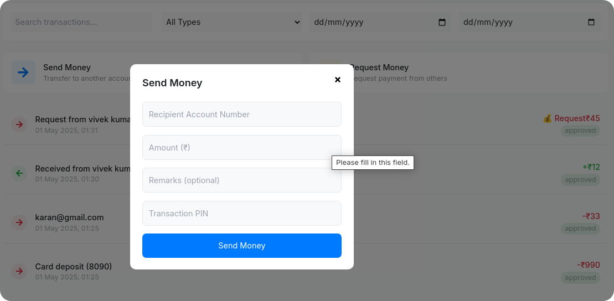
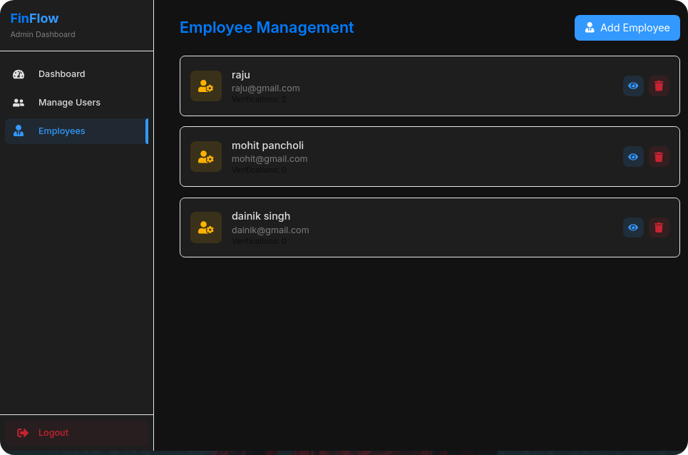
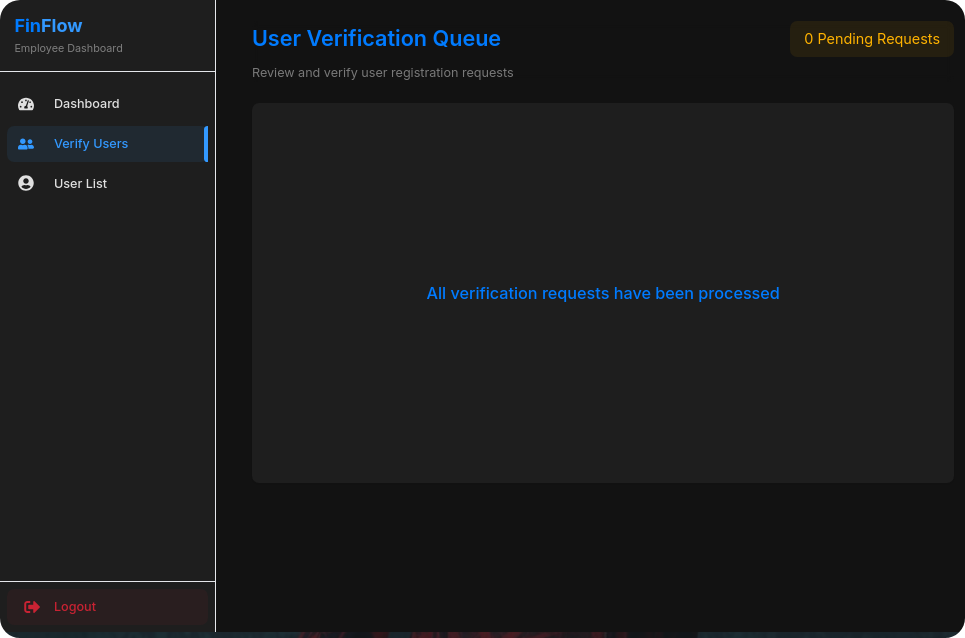

# FinFlow - Modern Banking Solution 🏦

  

  [Live Demo](https://finflow-bank.vercel.app)

  
  

## ✨ Key Features

- **Authentication & Security**
  - Face detection for profile photo
  - Email/Mobile OTP verification
  - Location tracking for transactions
  - PAN card verification system
  - Employee verification process
  - Transaction PIN security

- **Banking Features**
  - Send money instantly
  - Request money from users
  - Track transaction history
  - Download transaction receipts
  - Real-time balance updates
  - Account statements

## 🛠️ Technology Stack

### Frontend

  
  
  
  
  

- Redux Toolkit State Managment
- TailwindCSS for Styling
- Framer Motion for Animations
- Face-api.js for face detection

### Backend

  
  
  
  
  
  

- Node.js + Express
- MongoDB + Mongoose
- JWT Authentication
- ImageKit for file storage
- SendGrid for emails
- TextLink for SMS

### Development Tools

  
  
  
  
  

- VS Code
- Git + GitHub
- Chrome DevTools
- Postman
- npm

## 📸 Screenshots

  
  
  
  
    

---

  Made with ❤️ by Team FinFlow

